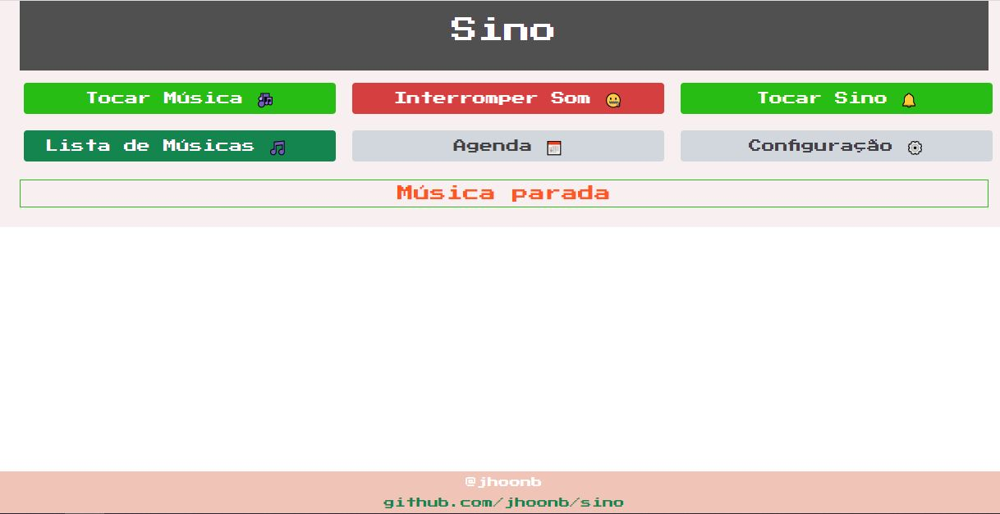
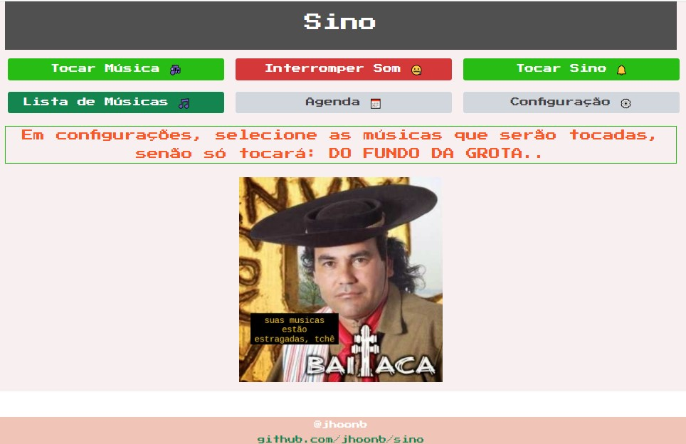

# Sino WEB

- copie a pasta `sino` para o `C:/`

- entre na pasta e gere um atalho de `index.html` para `Área de Trabalho`

- execute o arquivo na `Área de Trabalho`, abrirá o navegador.

- clique em **Configuração** e selecione as músicas e depois informe o caminho até a pasta,
por ex: `C:/Users/Usuario/Music/`

- em **Agendar**, para cada dia (segunda, terça, etc...) no campo 
**Musica**, insira os horários que tocará o sino (música); no campo **Sino** indique os horários
o qual soará um sino (arquivo padrão em `C:/sino/media/`)

- Para restaurar o horário padrão clique em **restaurar padrão** em **Agendar**

- atualize a página.

- todas as configurações ficam salvas em *localStorage*

- é possivel soar o sino clicando em **Tocar Sino**

- é possivel tocar uma música aleatória clicando em **Tocar Música**

- é possivel tocar uma música selecionando da lista clicando em **Lista de Músicas**

- para interromper qualquer som clique em **Interromper Som**

## Tela

## Tela Erro

Quando o app não consegue tocar uma música selecionada, ou as configurações
não tenham sido feitas, tocará o hino "Do Fundo da Grota".

##### @jhoonb - 2022
